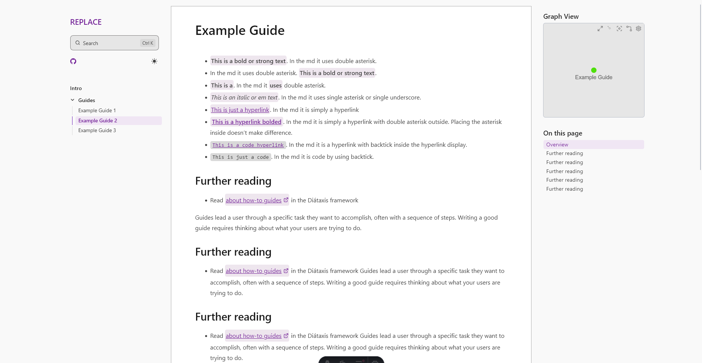
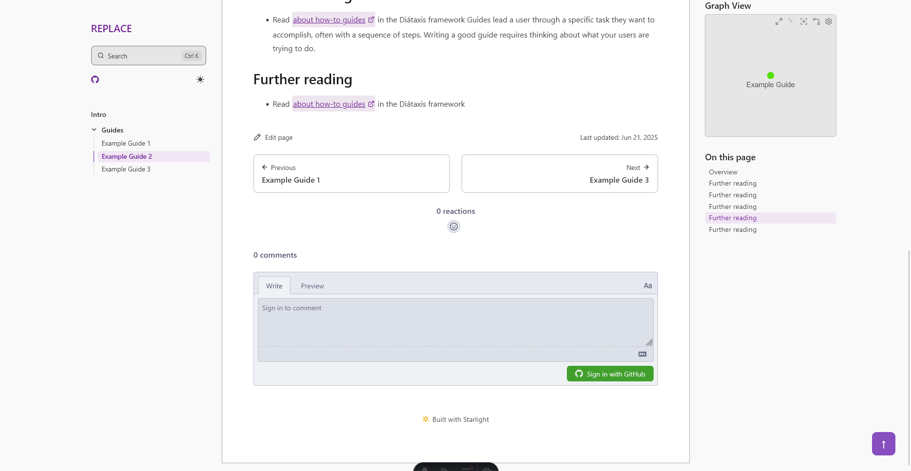
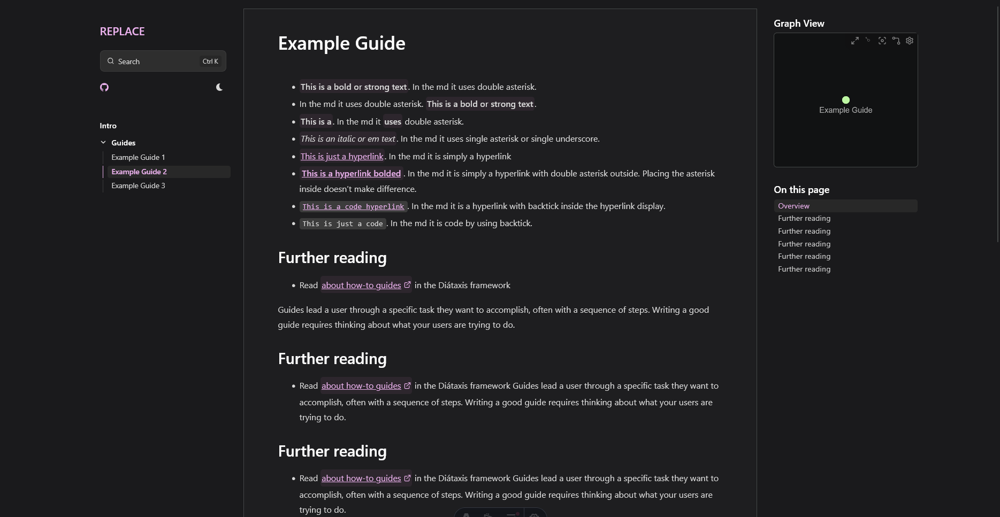
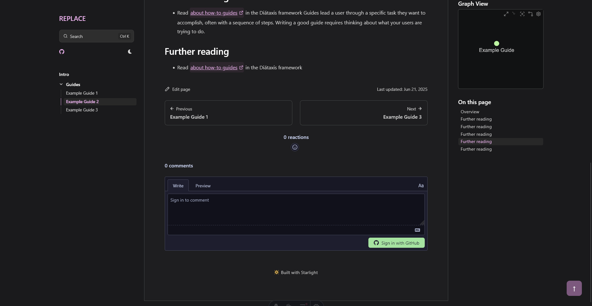

[Starlight docs](https://starlight.astro.build/) with [Obsidian theme](https://fevol.github.io/starlight-theme-obsidian/) and my own custom starter template.

Theme (modify the `src/assets/custom.css`)

1. Changed theme color for light and dark mode (pink accent for dark, purple accent for light).
2. Changed font size and font family of left and right sidebar and headings (to Source Code 3).
3. Increased content width and the spacing around. Padding top and bottom for left sidebar and padding top for main pane.
4. Decreased spacing between links on the left and right sidebar.
5. Use thin hairline for left and right sidebar.
6. Use light/dark gray background for left sidebar.

Docs

1. Removed splash page (replaced with `index.md` page directly).
2. Use custom slug on each `.md` file (define sidebar in `astro.config.mjs`).

Other

1. Edited `.gitignore` for editing in VSCode.
2. Need to replace every content with the comment `REPLACE`. Also rename the project in `package.json`.
3. Enable `scrollToView` for sidebar on the current page (overrided `Sidebar.astro`).

Used things

- [Starlight Obsidian](https://starlight-obsidian.vercel.app/): base theme
- [rehype-external-links](https://www.npmjs.com/package/rehype-external-links): add svg on external links.
- [Starlight Giscus](https://dragomano.github.io/starlight-giscus/): enable comment from GitHub discussion. (overrided `Pagination.astro`)
- [Starlight scroll to top](https://frostybee.github.io/starlight-scroll-to-top/): scroll to top button. (overrided `PageFrame.astro`)

Other useful thing to add:

- [Starlight sidebar topics dropdown](https://starlight-sidebar-topics-dropdown.trueberryless.org/): dropdown topic. (override Sidebar)
- [rehype-katex](https://www.npmjs.com/package/rehype-katex) and [remark-math](https://www.npmjs.com/package/remark-math): support for latex in markdown and rendering.

Light theme

with giscus and scroll

Dark theme

with giscus and scroll

